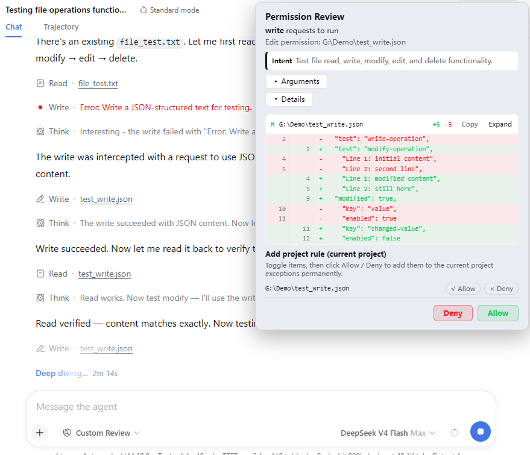
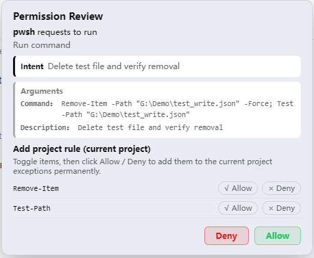
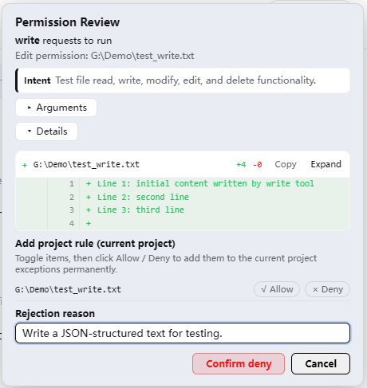

# dsh-permgate — Permission Gateway for DSH

> A fine-grained permission control plugin for [DeepSeek Harness](https://github.com/deepseek-ai/deepseek-harness) (DSH)

**🌏 [中文](README.md) | English**

`dsh` · `dsh-plugin` · `plugin` · `permission control` · `approval` · `sandbox` · `security` · `AI agent` · `权限控制` · `审批` · `沙箱` · `权限网关`

<!-- keywords: dsh, dsh-plugin, deepseek harness, plugin, permission control, approval, sandbox, security, ai agent, 权限控制, 审批, 沙箱, 权限网关, 自定义审查 -->

## Introduction

DSH ships only three permission levels — [Read only], [Workspace Write], [Full access] — which are too coarse. This plugin adds a **Custom Review** permission gateway that reviews tool calls one by one.

Tool calls are reviewed per category (directory access / command execution / file read / file write-edit / subagent spawn / repeated actions), with global & per-project configuration, allow/deny exceptions, quick-tool defaults, custom rules, and a bilingual (Chinese/English) approval modal with a sandbox-upgrade flow.

## Features

- **Six permission categories**: outside-workspace directories, command execution, file read/write, subagents and repeated actions are governed separately — each category has its own `ask / allow / deny` (projects can also `inherit global`), so you can be strict about sensitive actions and relaxed about routine ones, shaping the AI's boundaries to your habits.
- **Global / project levels**: one set of global rules for every project, fine-tuned per project; anything unset in a project automatically follows global — no duplicate configuration.
- **Exceptions (allow/deny lists)**: put paths or commands you "always allow" or "never allow" into exceptions — matched calls are allowed or denied outright, without prompting you every time.
- **Quick tools**: tools that don't map to files or commands (`web_search`, `skill`, `grep`, `glob`, `web_fetch`, …) can also get their own default: ask, allow or deny.
- **Custom rules**: combine tool name, file path and argument content into rules (e.g. "no tool may run `rm -rf`") — more flexible than category exceptions. Priority: custom rules > exceptions > defaults, so a few rules cover most situations.
- **Approval modal**: one popup shows everything — what the AI wants to do, why, and the concrete arguments; edit/write approvals also display the diff inline (+N/-N lines) so you don't need to compare files yourself. If a type of operation no longer needs asking, add it to the project allow/deny list in one click.
- **Custom rejection reason**: when denying, you can tell the AI "why not, and what to do instead" — the AI gets a clear reason and adjusts its plan immediately, instead of retrying against a cold "User denied".
- **Sandbox upgrade**: even after you allow a call, if DSH's underlying sandbox still blocks it (e.g. writing outside the workspace), the native sandbox-upgrade approval pops up — a one-shot grant that is automatically reverted afterwards, an extra layer of safety.
- **Bilingual UI**: follows the DSH interface language automatically (missing/invalid language parameters default to Chinese).
- **Persistence**: all settings live in the user directory and survive restarts.

## Usage

- **Session permission picker**: pick **"Custom Review"** in the permission picker below the input, and every tool call is reviewed per category by the permission gateway.

  

- **Default permission for new sessions**: set "Custom Review" as the default for new conversations in Settings, and every new conversation enables it automatically — no need to pick it manually each time.

  

- **Approval modal**: edit/write approvals show the diff detail so you can quickly judge whether the change is reasonable; run-command approvals show the command and its arguments — commands matching an exception pass through, others ask — with one-click rule candidates (e.g. `git status *`) to add frequently allowed commands to the exceptions.

  

  

- **Custom rejection reason**: type your feedback when denying, and the AI receives a clear "why not, and what to do instead" and adjusts its plan right away.

  

- **Settings → Permission Gateway**: manage everything in one place — per-category defaults, allow/deny exceptions, quick tools, custom rules and the underlying sandbox, configured separately for global and project levels, plus a recent-decision log. No more editing configuration files by hand — adjust permissions quickly through the settings page.

  

## Installation

### Option 1: install from the plugin market (dsh-market, recommended)

If you have [dsh-market](https://github.com/dsh-market/dsh-market) (the DSH plugin market) installed: open **Settings → Plugin Market**, search for `dsh-permgate`, click **Install** on the card and confirm the source when prompted (`github:MrWeiCodes/dsh-permgate`). After it finishes, **restart `dsh web`**. Then select **"Custom Review"** in the session permission picker (`/permission`).

### Option 2: let the AI install (easiest)

Just tell your DSH AI assistant the repository URL, e.g. "install the plugin https://github.com/MrWeiCodes/dsh-permgate". The AI handles plugin loading, dependencies and the patch for you; afterwards restart `dsh web` and select **"Custom Review"** in the session permission picker (`/permission`, remembered per conversation; optionally set it as the default for new sessions in Settings → Permission).

### Option 3: one-liner (self-service)

DeepSeek Harness requires a supported Node.js version. The host-side plugin is plain ESM JavaScript and the browser registration script ships as a runtime file committed directly in this repository. The package has no build, prepare or install scripts, so installing from Git does not require authorizing pnpm to run builds.

Install from GitHub:

```powershell
dsh plugin --profile web add -w github:MrWeiCodes/dsh-permgate
```

Install from a local checkout (dependencies resolve only when the checkout lives inside the profile directory; otherwise use Option 4):

```powershell
dsh plugin --profile web add -w ./dsh-permgate
```

Restart `dsh web`, then select **"Custom Review"** in the session permission picker (`/permission`, remembered per conversation); optionally set it as the default for new sessions in Settings → Permission.

> If you previously installed manually (Option 4), follow Uninstallation first to remove the old manual rows and dependency, then use Option 3 to avoid duplicate registration.

### Option 4: manual installation

Fallback for environments without pnpm or for offline use:

1. Place this repository into your DSH profile's plugin directory:
   ```powershell
   # example: web profile
   $dst = "$HOME\.dsh\profiles\web\packages\dsh-permgate"
   git clone https://github.com/MrWeiCodes/dsh-permgate.git $dst
   ```
2. Add to the `dependencies` of the profile's `package.json`:
   ```json
   "dsh-permgate": "file:./packages/dsh-permgate"
   ```
3. Append the contents of `cordis.patch.yml` to your profile's `cordis.patch.yml`.
4. Reinstall dependencies and restart: `pnpm install` (or `npm install`), then `dsh web`.

## Updating

Pick the command matching how you installed — **your configuration (`$DSH_HOME/dsh-permgate/config.json`) is preserved across updates**, no need to reconfigure.

- **Installed via Option 1 (dsh-market)**: open **Settings → Plugin Market**, click **Update** on the dsh-permgate card (or use the market's one-click/batch update).
- **Installed via Option 2 (AI)**: just tell your AI assistant "update the dsh-permgate plugin".
- **Installed via Option 3 (dsh plugin)**:
  ```powershell
  dsh plugin --profile web update dsh-permgate
  ```
  If the latest commit is not fetched (git dependencies are cached), remove and re-add:
  ```powershell
  dsh plugin --profile web remove dsh-permgate
  dsh plugin --profile web add -w github:MrWeiCodes/dsh-permgate
  ```
  Then restart `dsh web`.
- **Installed via Option 4 (manual)**:
  ```powershell
  cd "$HOME\.dsh\profiles\web\packages\dsh-permgate"
  git pull            # or re-copy the new version over the old files
  pnpm install        # run only if the dependency declarations changed
  ```
  Then restart `dsh web`.

## Uninstallation

### Installed via Option 1 (dsh-market): uninstall from the plugin market

Open **Settings → Plugin Market**, click **Uninstall** on the dsh-permgate card (two-step confirm); plugins installed in this session are removed live. The config directory `$DSH_HOME/dsh-permgate/` is **not** deleted automatically — keep or clean it per the "Leftover locations" checklist below.

### Installed via Option 2 (AI): let the AI uninstall

Just tell your AI assistant "uninstall the dsh-permgate plugin". The AI removes the plugin, cleans up the patch and dependencies, and deletes the config directory following the "Leftover locations" checklist below (say so in advance if you want to keep the config).

### Installed via Option 3 (dsh plugin)

```powershell
dsh plugin --profile web remove dsh-permgate
```

`dsh plugin remove` only removes the plugin itself and its patch layer — it does **not** delete the config directory; delete `$DSH_HOME/dsh-permgate/` per the checklist below.

### Installed via Option 4 (manual)

1. Remove the `- insert: permgate` row from your profile's `cordis.patch.yml`; the `permission` preset override block can be removed too (restores the platform's default preset table).
2. Remove `"dsh-permgate": ...` from the `dependencies` of the profile's `package.json`.
3. Reinstall dependencies and restart: `pnpm install` (or `npm install`), then `dsh web`.
4. Delete the plugin directory and the config directory (paths in the checklist below).

### Leftover locations (cleanup checklist for the AI)

- **Config directory**: `$DSH_HOME/dsh-permgate/` — `$DSH_HOME` defaults to `~/.dsh` (`C:\Users\<username>\.dsh` on Windows); the plugin's `config.json` lives here. Uninstallation does not delete it automatically; the AI deletes the whole directory when uninstalling.
- **Plugin directory** (Option 4 installs): `$DSH_HOME/profiles/<profile>/packages/dsh-permgate/`.
- **Dependency & patch** (Option 4 installs): the `"dsh-permgate": ...` dependency in the profile's `package.json`, plus the `- insert: permgate` row and the `permission` preset override in `cordis.patch.yml`.
- **Session logs**: the `permission/preset: custom-review` events in sessions are DSH's own records — **not plugin residue, do not delete them**.

### Uninstall leftovers

- **Config file**: `$DSH_HOME/dsh-permgate/config.json` is not deleted automatically (it is the plugin's only persistent file); remove it manually if desired.
- **Session history**: sessions that selected "Custom Review" keep their `permission/preset` events — these are DSH's own session-log records, not data written by this plugin, so they are not plugin residue. After uninstall the preset no longer exists and the permission picker gracefully falls back to a built-in preset matching the current sandbox/approval settings (e.g. Workspace Write) — no errors.
- **Session-level knobs**: sessions whose underlying sandbox was switched to Full access via the settings page keep their `sandbox/mode` session event and it still applies after uninstall (that is DSH session state, not plugin residue).
- **Browser side**: the badge and preset-name DOM injections live only in page memory and vanish on refresh; approval modals are in-memory and disappear with the process.
- No global registry, npm global packages, or system-level writes.

## Configuration file location

`$DSH_HOME/dsh-permgate/config.json`

## Language and preset-name display

- The plugin's own UI strings (modal, panel, dock) are registered with DSH's locale service and follow the interface language; missing/invalid language parameters default to Chinese.

## Compatibility & conflicts

- **Zero-intrusion, trace-free plug & unplug**: the plugin uses only DSH's public interfaces (plugin loading, `webServer` routes, the `tools` pre-execute review chain, `locale`/`slots` services, …) and does **not** modify native DSH code or internals via hooks or patching. Uninstalling removes it completely from the process; after a page refresh nothing remains in the browser.
- **HTTP routes**: all endpoints live under `/permgate/*` (including the SSE endpoint `/permgate/events`); collision with other plugins is very unlikely.
- **Slot ids**: the settings page, dock bar and modal use distinct ids (`permgate`, `permgate-approval`, …). A clash with another plugin's slot id fails loudly (it throws), never silently breaks.
- **`permission` preset-table override**: the `permission` block in the patch uses whole-table override semantics (restates every preset). If another patch overrides the same config they will clobber each other — do not combine with other patches that modify the `permission` config.
- **Similar permission plugins**: installing another pre-execute review plugin (e.g. dsh-auto-approve) alongside means both review chains run and may double-prompt — keep only one.
- **Native approval service**: permgate's pre-review uses its own modal (not DSH's approval service); the sandbox-upgrade approval uses the native `approval.request` — no conflict.
- **Display layer**: preset-name localization and the badge are a best-effort DOM layer, display-only; other plugins touching the same DOM may visually overlap, which never affects enforcement.

## Custom development

```powershell
# The repository files are the plugin sources (index.js = host half, client.js = browser half)
node --check index.js
node --check client.js
```

To customize the plugin, use DSH's Creator mode for quick development.

## License

[MIT](LICENSE)
