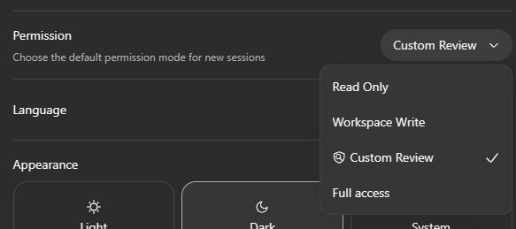
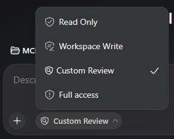
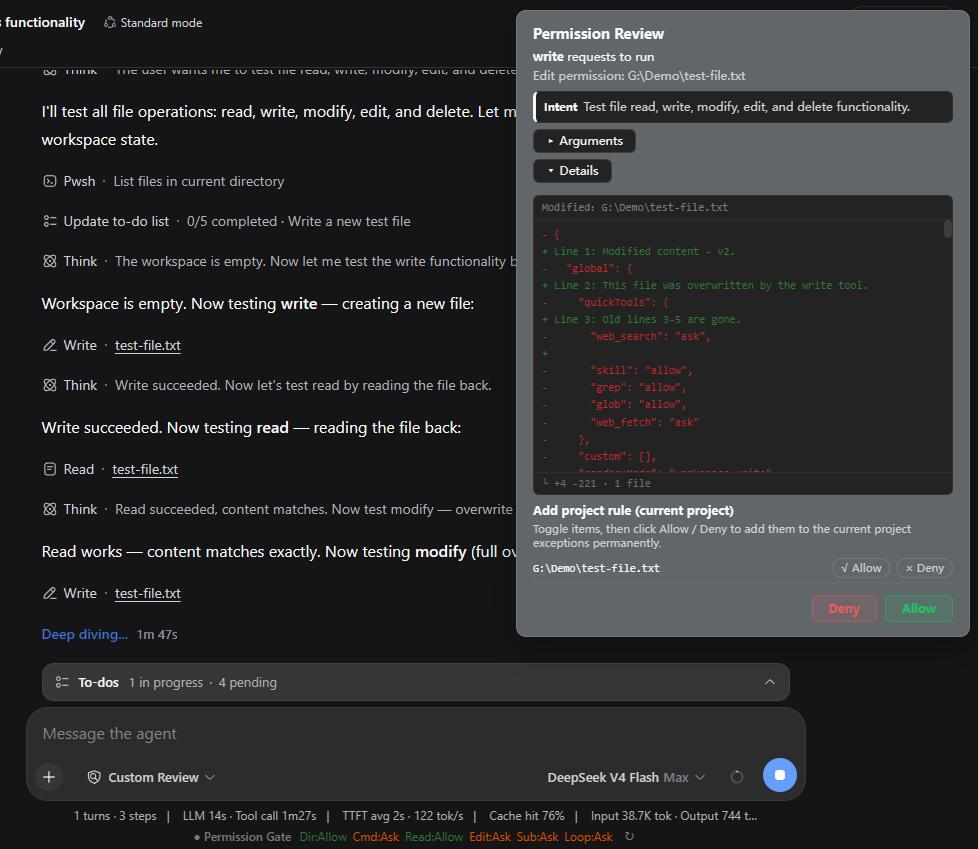
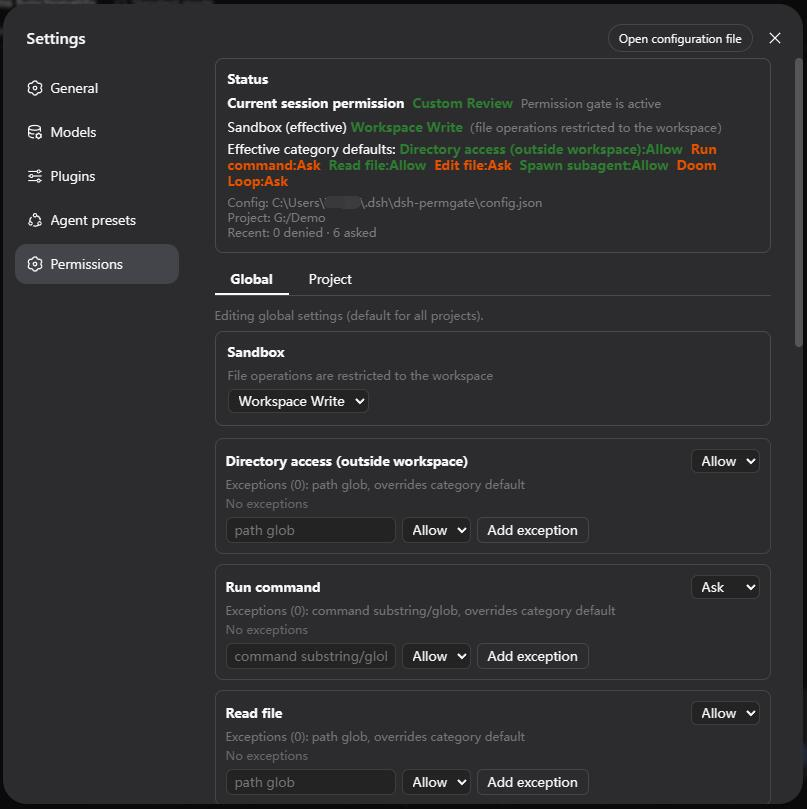

# dsh-permgate — Permission Gateway for DSH

> A fine-grained permission control plugin for [DeepSeek Harness](https://github.com/deepseek-ai/deepseek-harness) (DSH)

**🌏 [中文](README.md) | English**

`dsh` · `dsh-plugin` · `plugin` · `permission control` · `approval` · `sandbox` · `security` · `AI agent` · `权限控制` · `审批` · `沙箱` · `权限网关`

<!-- keywords: dsh, dsh-plugin, deepseek harness, plugin, permission control, approval, sandbox, security, ai agent, 权限控制, 审批, 沙箱, 权限网关, 自定义审查 -->

## Introduction

DSH ships only three permission levels — [Read only], [Workspace Write], [Full access] — which are too coarse. This plugin adds a **Custom Review** permission gateway that reviews tool calls one by one.

Tool calls are reviewed per category (directory access / command execution / file read / file write-edit / subagent spawn / repeated actions), with global & per-project configuration, allow/deny exceptions, quick-tool defaults, custom rules, and a bilingual (Chinese/English) approval modal with a sandbox-upgrade flow.

## Features

- **Six permission categories**: `directory` (outside-workspace access), `command` (run commands), `read` (read files), `edit` (write/edit files), `subagent` (spawn subagents), `doomloop` (repeated identical calls). Each category: `ask / allow / deny` (project level also supports `inherit global`).
- **Global / project levels**: project settings override global; projects can inherit global.
- **Exceptions (allow/deny lists)**: the four path/command categories support path-glob or command-substring exceptions that bypass further prompts.
- **Quick tools**: uncategorized tools (`web_search`, `skill`, `grep`, `glob`, `web_fetch`, …) use their own allow/ask/deny defaults.
- **Custom rules**: match any combination of `tool` (wildcard), `path` (glob), `args` (substring). Priority: custom rules > category exceptions > category defaults / quick tools.
- **Approval modal**: shows the tool, intent, collapsible args, a **diff detail** for edit/write approvals (`▸ Details` expands +N/-N stats), and "add to project rules" candidates (one click turns this operation into a project exception).
- **Sandbox upgrade**: after a permgate allow, if the underlying sandbox rejects the call (e.g. writing outside the workspace), the native sandbox-upgrade approval pops up automatically (one-shot upgrade, written back afterwards).
- **Bilingual UI**: follows the DSH interface language (missing/invalid language parameters default to Chinese).
- **Persistence**: configuration is stored at `$DSH_HOME/dsh-permgate/config.json` and survives restarts.

## Installation

### Option 1: let the AI install (easiest)

Just tell your DSH AI assistant the repository URL, e.g. "install the plugin https://github.com/MrWeiCodes/dsh-permgate". The AI handles plugin loading, dependencies and the patch for you; afterwards restart `dsh web` and select **"Custom Review"** in the session permission picker (`/permission`, remembered per conversation; optionally set it as the default for new sessions in Settings → Permission).

### Option 2: one-liner (self-service)

DeepSeek Harness requires a supported Node.js version. The host-side plugin is plain ESM JavaScript and the browser registration script ships as a runtime file committed directly in this repository. The package has no build, prepare or install scripts, so installing from Git does not require authorizing pnpm to run builds.

Install from GitHub:

```powershell
dsh plugin --profile web add github:MrWeiCodes/dsh-permgate
```

Install from a local checkout:

```powershell
dsh plugin --profile web add ./dsh-permgate
```

Restart `dsh web`, then select **"Custom Review"** in the session permission picker (`/permission`, remembered per conversation); optionally set it as the default for new sessions in Settings → Permission.

> If you previously installed manually (Option 3), follow Uninstallation first to remove the old manual rows and dependency, then use Option 2 to avoid duplicate registration.

### Option 3: manual installation

Fallback for environments without pnpm or for offline use:

1. Place this repository into your DSH profile's plugin directory:
   ```powershell
   # example: web profile
   $dst = "$HOME\.dsh\profiles\web\packages\dsh-permgate"
   git clone https://github.com/MrWeiCodes/dsh-permgate.git $dst
   ```
2. Add to the `dependencies` of the profile's `package.json`:
   ```json
   "dsh-permgate": "file:./packages/dsh-permgate"
   ```
3. Append the contents of `cordis.patch.yml` to your profile's `cordis.patch.yml`.
4. Reinstall dependencies and restart: `pnpm install` (or `npm install`), then `dsh web`.

## Uninstallation

### Installed via Option 1 (AI): let the AI uninstall

Just tell your AI assistant "uninstall the dsh-permgate plugin". The AI removes the plugin, cleans up the patch and dependencies, and deletes the config directory following the "Leftover locations" checklist below (say so in advance if you want to keep the config).

### Installed via Option 2 (dsh plugin)

```powershell
dsh plugin --profile web remove dsh-permgate
```

`dsh plugin remove` only removes the plugin itself and its patch layer — it does **not** delete the config directory; delete `$DSH_HOME/dsh-permgate/` per the checklist below.

### Installed via Option 3 (manual)

1. Remove the `- insert: permgate` row from your profile's `cordis.patch.yml`; the `permission` preset override block can be removed too (restores the platform's default preset table).
2. Remove `"dsh-permgate": ...` from the `dependencies` of the profile's `package.json`.
3. Reinstall dependencies and restart: `pnpm install` (or `npm install`), then `dsh web`.
4. Delete the plugin directory and the config directory (paths in the checklist below).

### Leftover locations (cleanup checklist for the AI)

- **Config directory**: `$DSH_HOME/dsh-permgate/` — `$DSH_HOME` defaults to `~/.dsh` (`C:\Users\<username>\.dsh` on Windows); the plugin's `config.json` lives here. Uninstallation does not delete it automatically; the AI deletes the whole directory when uninstalling.
- **Plugin directory** (Option 3 installs): `$DSH_HOME/profiles/<profile>/packages/dsh-permgate/`.
- **Dependency & patch** (Option 3 installs): the `"dsh-permgate": ...` dependency in the profile's `package.json`, plus the `- insert: permgate` row and the `permission` preset override in `cordis.patch.yml`.
- **Session logs**: the `permission/preset: custom-review` events in sessions are DSH's own records — **not plugin residue, do not delete them**.

### Uninstall leftovers

- **Config file**: `$DSH_HOME/dsh-permgate/config.json` is not deleted automatically (it is the plugin's only persistent file); remove it manually if desired.
- **Session history**: sessions that selected "Custom Review" keep their `permission/preset` events — these are DSH's own session-log records, not data written by this plugin, so they are not plugin residue. After uninstall the preset no longer exists and the permission picker gracefully falls back to a built-in preset matching the current sandbox/approval settings (e.g. Workspace Write) — no errors.
- **Session-level knobs**: sessions whose underlying sandbox was switched to Full access via the settings page keep their `sandbox/mode` session event and it still applies after uninstall (that is DSH session state, not plugin residue).
- **Browser side**: the badge and preset-name DOM injections live only in page memory and vanish on refresh; approval modals are in-memory and disappear with the process.
- No global registry, npm global packages, or system-level writes.

## Compatibility & conflicts

- **Zero-intrusion, trace-free plug & unplug**: the plugin uses only DSH's public interfaces (plugin loading, `webServer` routes, the `tools` pre-execute review chain, `locale`/`slots` services, …) and does **not** modify native DSH code or internals via hooks or patching. Uninstalling removes it completely from the process; after a page refresh nothing remains in the browser.
- **HTTP routes**: all endpoints live under `/permgate/*` (including the SSE endpoint `/permgate/events`); collision with other plugins is very unlikely.
- **Slot ids**: the settings page, dock bar and modal use distinct ids (`permgate`, `permgate-approval`, …). A clash with another plugin's slot id fails loudly (it throws), never silently breaks.
- **`permission` preset-table override**: the `permission` block in the patch uses whole-table override semantics (restates every preset). If another patch overrides the same config they will clobber each other — do not combine with other patches that modify the `permission` config.
- **Similar permission plugins**: installing another pre-execute review plugin (e.g. dsh-auto-approve) alongside means both review chains run and may double-prompt — keep only one.
- **Native approval service**: permgate's pre-review uses its own modal (not DSH's approval service); the sandbox-upgrade approval uses the native `approval.request` — no conflict.
- **Display layer**: preset-name localization and the badge are a best-effort DOM layer, display-only; other plugins touching the same DOM may visually overlap, which never affects enforcement.

## Usage

- **Settings → Permission Gateway**: category defaults, exceptions, quick tools, custom rules, the underlying sandbox (global/project tabs; projects can inherit global), plus recent-decision stats.
- **Default permission for new sessions**:

  
- **Composer dock bar / session permission picker**: shown only while the current session is "Custom Review".

  
- **Approval modal**: edit/write approvals expand the diff detail by default and collapse args; command approvals offer subcommand-grained candidates (e.g. `git status *`).

  

## Quick permission setup via the GUI

No more editing configuration files by hand — adjust permissions quickly through the settings page.



## Configuration file location

`$DSH_HOME/dsh-permgate/config.json`

## Language and preset-name display

- The plugin's own UI strings (modal, panel, dock) are registered with DSH's locale service and follow the interface language; missing/invalid language parameters default to Chinese.

## Custom development

```powershell
# The repository files are the plugin sources (index.js = host half, client.js = browser half)
node --check index.js
node --check client.js
```

To customize the plugin, use DSH's Creator mode for quick development.

## License

[MIT](LICENSE)
